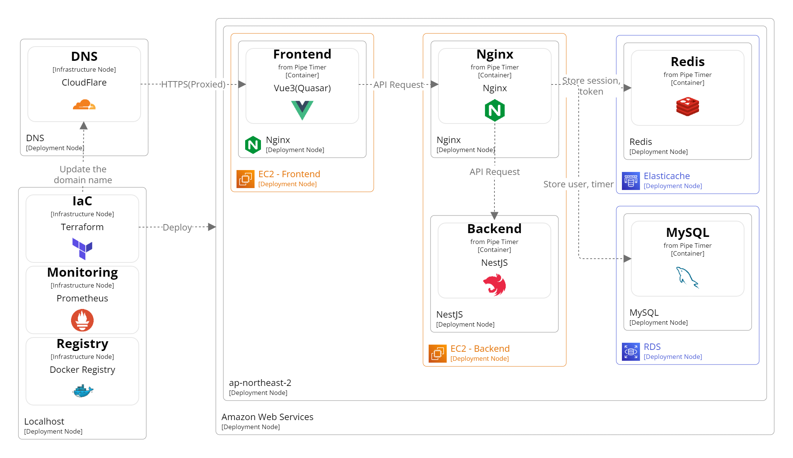

<!-- PROJECT LOGO -->
<br />
<div align="center">
  <a href="./assets/pipe-timer-logo-teal.png">
    
  </a>

<h3 align="center">Pipe Timer</h3>

  <p align="center">
    One app for flexible piping of timers to enhance productivity
    <br />
    <a href="https://pipetimer.com"><strong>Demo |</strong></a>
    <a href="https://pipetimer.com/guide"><strong>Guides </strong></a>
    <br />
    <br />
  </p>
</div>

## 🔥The project is alive!!🔥

I've long thought that the difference between a professional and an amateur is 'the ability to consistently perform well,' and as a result, I've become very interested in productivity tools like the Pomodoro Timer. This, combined with my serious intention to study development, has led me to my current project.

I'm taking this project quite seriously, but I'm not in a paid developer and development is purely a hobby that I can only work on in my spare time. Due to this, updates may be slow and even server downtime can occur. However, this project is alive and I intend to continue it as much as I can. Thank you for taking an interest in this project.

## Description

Pipe Timer is an app designed to enhance productivity by allowing users to freely combine timers with push notifications. Users can create a series of "timers", referred to as "routines", to plan out regular and segmented work and rest periods(or something you want).

When each timer expires, a desktop notification is sent to alert the user. You can use Pipe Timer either way—for simple, straightforward use without signing up, or by registering as a member to enjoy the additional feature of saving timers and routines on the server. This allows users to utilize their routines in different environments without having to reconfigure them.

## Getting Started

You can either use [Pipe Timer](https://pipetimer.com) directly or host it locally using Docker.

### Prerequisites

The following tools are essentially required to run the app properly.

- [pnpm](https://pnpm.io/installation/)
- [Docker Engine](https://docs.docker.com/engine/install/ubuntu/)
- [Docker Compose](https://docs.docker.com/compose/)

### Installation

1. Clone the repository.
   ```sh
   git clone https://github.com/yidoyoon/pipe-timer.git
   cd pipe-timer
   ```
2. Generate two dummy certificates for HTTPS server operation using [mkcert](https://github.com/FiloSottile/mkcert). The following command installs the packages required for mkcert installation and execution, and runs a script to generate a certificate. The script is located at `./shared/helper/generate-local-certs.sh`, and you can modify it if needed.
   ```sh
   pnpm dev:cert:init
   ```
3. Set the essential environment variables required for app operation. The file providing these environment variables is located at `backend/env/.development.env`. Set `HOST_URL` according to your environment and domain.

   ```dotenv
   # Nodemailer(Required)
   EMAIL_SERVICE=
   EMAIL_AUTH_USER=
   EMAIL_AUTH_PASSWORD=

   # Sendgrid
   SENDGRID_KEY=

   # Backend(Docker compose)
   API_PORT_0=
   API_PORT_1=
   API_PORT_2=
   API_PORT_3=

   # Frontend(Docker compose)
   FRONT_PORT_0=
   FRONT_PORT_1=
   FRONT_PORT_2=

   # MySQL DB
   DB_NAME=
   DB_USERNAME=
   DB_PASSWORD=

   # Access token and session secret
   JWT_SECRET=
   SESSION_SECRET=

   # Swagger ID, PASSWORD
   SWAGGER_ID=
   SWAGGER_PASSWORD=

   # Docker tag
   DOCKER_REGISTRY=
   ```

4. Run

   ```sh
   pnpm dev:compose:up
   ```

5. Access the address set in `HOST_URL` on port `4000` through your browser. Example: `https://localhost:4000`

## Architecture Diagram



## Demo Screenshot


## Roadmap

- [x] Add monitoring infrastructure
  - [x] Resource monitoring
  - [x] Log collection
- [ ] Usage statistics feature
- [ ] Timer data sharing
  - [ ] Direct sharing on the web
  - [ ] Export to file
- [ ] Smartphone platform optimization

## License

Distributed under the `GPL-3.0`

## Credits

- [NestJS](https://nestjs.com/)
- [Quasar](https://quasar.dev/)
- [NestJS로 배우는 백엔드 프로그래밍](https://wikidocs.net/book/7059)

[product-screenshot]: images/run_routine_example.png
