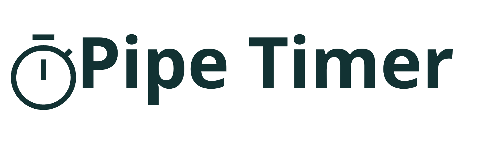
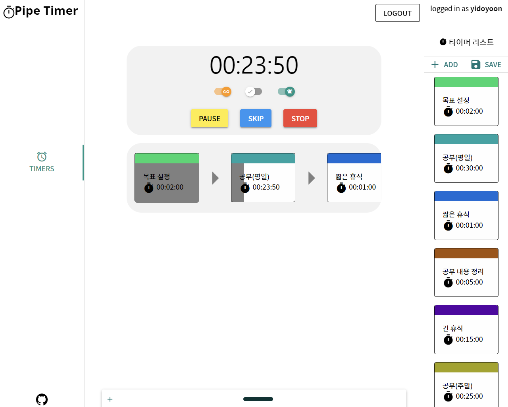

<!-- PROJECT LOGO -->
<br />
<div align="center">
  <a href="./assets/pipe-timer-logo-teal.png">
    
  </a>

<h3 align="center">Pipe Timer</h3>

  <p align="center">
    One app for flexible piping of timers to enhance productivity
    <br />
    <a href="https://pipetimer.com"><strong>View Demo »</strong></a>
    <br />
    <br />
  </p>
</div>

## 프로젝트 설명

Pipe Timer는 생산성 향상을 위해 자유롭게 타이머를 조합할 수 있는 앱입니다. 사용자는 "루틴"이라고 불리는 연속된 타이머를 구성하여 규칙적이고 세분화된 업무 및 휴식 시간을 계획할 수 있습니다.

각각의 타이머가 만료되면 데스크톱 알림을 통해 사용자에게 알림을 제공합니다. Pipe Timer는 회원가입 없이도 사용할 수 있지만, 회원으로 가입하면 타이머와 루틴을 서버에 저장하는 기능도 제공합니다. 이를 통해 다른 환경에서도 루틴을 다시 구성하지 않고도 사용할 수 있습니다.

## 시작하기

[Pipe Timer](https://pipetimer.com)에서 바로 사용하거나 도커를 활용하여 로컬에서 직접 호스팅할 수 있습니다.

### 필요 사항

앱을 정상적으로 구동하기 위해선 아래와 같은 도구가 기본적으로 필요합니다. 각 도구들의 최신 버전을 설치해주세요

- [npm](https://github.com/nodesource/distributions#installation-instructions)
- [Docker Engine](https://docs.docker.com/engine/install/ubuntu/)
- [Docker Compose](https://docs.docker.com/compose/)

### 설치

1. 레포지토리를 복사합니다.
   ```sh
   git clone https://github.com/yidoyoon/pipe-timer.git
   cd pipe-timer
   ```
2. 서버를 HTTPS로 구동하기 위한 인증서를 mkcert로 생성합니다. 아래 명령어는 mkcert 설치와 실행에 필요한 패키지를 설치하고 인증서를 생성하는 스크립트를 실행합니다. 스크립트는 `.github/scripts/create-local-certs.sh`에 위치하고 있으며, 필요하다면 수정해서 사용할 수 있습니다.
   ```sh
   npm run dev:cert:init
   ```
3. 앱 구동에 필요한 필수 환경변수를 설정합니다. 환경 변수를 제공하는 파일은 `backend/env/.development.env`에 있습니다. `HOST_URL`은 자신의 환경, 도메인에 맞추어 설정합니다.

   ```dotenv
   # Nodemailer(Required)
   EMAIL_SERVICE=
   EMAIL_AUTH_USER=
   EMAIL_AUTH_PASSWORD=

   # Sendgrid
   SENDGRID_KEY=

   # Backend(Docker compose)
   API_PORT_0=
   API_PORT_1=
   API_PORT_2=
   API_PORT_3=

   # Frontend(Docker compose)
   FRONT_PORT_0=
   FRONT_PORT_1=
   FRONT_PORT_2=

   # MySQL DB
   DB_NAME=
   DB_USERNAME=
   DB_PASSWORD=

   # Access token and session secret
   JWT_SECRET=
   SESSION_SECRET=

   # Swagger ID, PASSWORD
   SWAGGER_ID=
   SWAGGER_PASSWORD=

   # Docker tag
   DOCKER_REGISTRY=
   ```

4. 앱을 구동합니다.

   ```sh
   npm run dev:compse:up
   ```

5. 브라우저에서 `HOST_URL`에서 설정한 주소의 `4000`포트로 접근합니다. 예시) `https://localhost:4000`

## 구동 화면



## 로드맵

- [x] 모니터링 인프라 추가
  - [x] 리소스 모니터링
  - [ ] 로그 수집
- [ ] 사용량 통계 기능
- [ ] 타이머 데이터 공유
  - [ ] 웹에서 직접 공유
  - [ ] 파일로 추출
- [ ] 스마트폰 플랫폼 최적화

## License

Distributed under the `GPL-3.0`

## Credits

- [NestJS](https://nestjs.com/)
- [Quasar](https://quasar.dev/)
- [NestJS로 배우는 백엔드 프로그래밍](https://wikidocs.net/book/7059)

[product-screenshot]: images/run_routine_example.png
